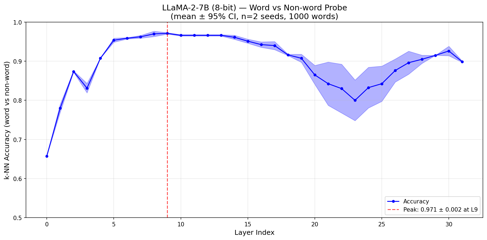
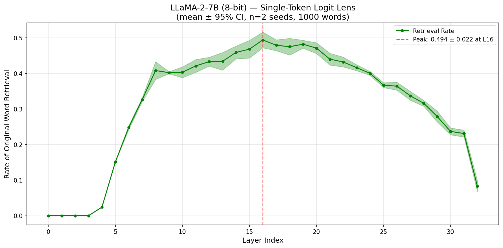
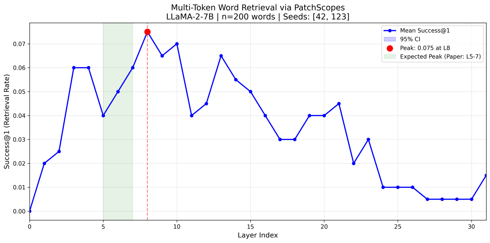
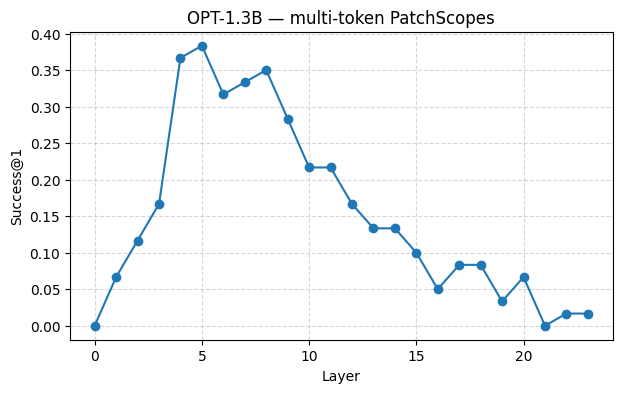
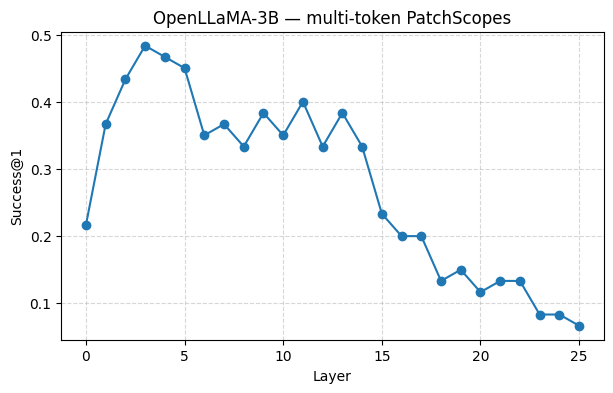

# How LLMs Reconstruct Words

Interpretability experiments investigating how decoder-only LLMs internally reconstruct whole-word meaning from subword tokens. This work reproduces and extends the [Tokens2Words](https://arxiv.org/abs/2410.05864) framework across multiple model architectures.

## Overview

Large Language Models process text as subword tokens. A word like *"unhappiness"* might be split into `"un"`, `"h"`, `"appiness"`. These experiments probe **where and how** models reassemble word-level meaning from these fragments, using three complementary methods:

| Probe | What it tests | Models |
|-------|--------------|--------|
| **k-NN Word vs Non-Word** | Whether hidden states separate real words from corrupted variants | LLaMA-2-7B |
| **Single-Token Logit Lens** | Whether artificially split single-token words can be mapped back to their original embedding | LLaMA-2-7B |
| **PatchScopes Decoding** | Whether multi-token words are preserved as latent lexical units beyond the tokenizer vocabulary | LLaMA-2-7B, OPT-1.3B, OpenLLaMA-3B |

## Key Findings

- **All models** develop strong "wordness" signals in mid-to-early layers (k-NN and PatchScopes)
- **Single-token detokenization** via logit lens appears only in LLaMA-2-7B (peak 49.4% at layer 16) and is essentially absent in GPT-2 and OPT models
- **PatchScopes on LLaMA-2-7B** yields 7.5% Success@1 vs. the 64% reported in the original paper, suggesting that the model's ability to recover full words depends heavily on how the experiment is set up
- **OpenLLaMA-3B** achieved the highest PatchScopes Success@1 (48% at layer 3), with word-level information emerging particularly early

## Results

### k-NN Word vs Non-Word Classification — LLaMA-2-7B


Peak accuracy: **97.1% at layer 9** (mean over 2 seeds, 1000 words)

### Single-Token Logit Lens — LLaMA-2-7B


Peak retrieval rate: **49.4% ± 2.2% at layer 16** (2 seeds, 1000 words)

### PatchScopes Multi-Token Reconstruction
| Model | Peak Success@1 | Peak Layer | Words |
|-------|---------------|------------|-------|
| LLaMA-2-7B | 7.5% | Layer 8 | 200 |
| OpenLLaMA-3B | 48.3% | Layer 3 | 60 |
| OPT-1.3B | 38.3% | Layer 5 | 60 |





## Repository Structure

```
knn-and-logit-lens/
  LLaMA2-7B_k-NN-Word_and_Single-Token.ipynb   # k-NN + logit lens experiments
  knn_results-LLaMA2-7B.png                     # k-NN result plot
  logit_lens_results-LLaMA2-7B.png              # Logit lens result plot
patchscopes/
  patchscopes-llama2-7b-hf.ipynb                # PatchScopes on LLaMA-2-7B
  patchscopes_multitoken_openLLama_3B_and_OPT_1-3B.ipynb  # PatchScopes on OPT-1.3B & OpenLLaMA-3B
  LLaMA2-7B_patchscopes.webp                    # LLaMA-2-7B PatchScopes plot
  opt1-3b_multitok_success.png                   # OPT-1.3B result plot
  openllama3b_multitok_success.png               # OpenLLaMA-3B result plot
  word_list.txt                                  # Multi-token word list used
```

## Methodology

- **Dataset:** WikiText-103 (k-NN, logit lens, LLaMA-2-7B PatchScopes), WordFreq (OPT/OpenLLaMA PatchScopes)
- **Statistical validation:** 2 random seeds (42, 123) with mean ± 95% CI for all LLaMA-2-7B experiments
- **Hardware:** Kaggle T4 GPUs with 8-bit quantization for LLaMA-2-7B
- **PatchScopes prompt:** `"English: X, X"` using the [Tokens2Words library](https://github.com/schwartz-lab-NLP/Tokens2Words)

## Context

This work was conducted as part of a group project for **COMP 433** at Concordia University. The experiments here represent my individual contributions to the project.

## References

- Kaplan et al., *"From Tokens to Words: On the Inner Lexicon of LLMs"*, arXiv:2410.05864, 2024
- Ghandeharioun et al., *"PatchScopes: A Unifying Framework for Inspecting Hidden Representations of Language Models"*, ICML 2024
- [Tokens2Words GitHub Repository](https://github.com/schwartz-lab-NLP/Tokens2Words)
